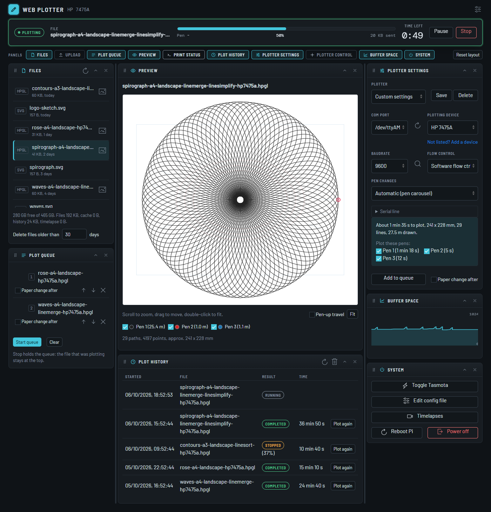

# Web Plotter: a web interface for pen plotters

[](https://github.com/jaysuk/penplotter-webserver/actions/workflows/tests.yml)
[](https://github.com/jaysuk/penplotter-webserver/actions/workflows/install_test.yml)



A web service for a Raspberry Pi that sits between a browser and a pen plotter on a serial port. Upload an SVG or HPGL file, convert it for your plotter with [vpype](https://github.com/abey79/vpype), look at it, and send it to the plotter with flow control that suits the plotter, from a phone, a tablet or a computer on the same network.

This is the `PiPlot` branch of a fork. It is built for the [Pi Plot shield](https://github.com/ithinkido/PiPlot) but works with any USB or serial adapter. It started as [henrytriplette/penplotter-webserver](https://github.com/henrytriplette/penplotter-webserver) and was extended by [ithinkido/penplotter-webserver](https://github.com/ithinkido/penplotter-webserver). The page and most of the backend have been rewritten since, so changes do not merge back cleanly.

## What it does

**Files**
- Upload `.svg`, `.hpgl` and CalComp `.cal` files (and `.pdf`, first page only, when poppler's `pdftocairo` is installed). Delete files, see their size and age, and clear old files and the cache.
- Convert SVG to HPGL with vpype: page size, orientation, output size, margin, rotate, mirror, plot speed, line merge, line sort, line simplify, reloop, or your own vpype commands (including plugins installed in the server's environment). Save the options as a *preset*.
- Preview a conversion before saving it, with the paper outline on it.
- Draw typed text as an SVG, ready to convert.
- Preview any HPGL or CAL file in the browser: zoom, pan, colours per pen, pen-up travel, a position read-out in mm and a replay.

**Plotting**
- Several flow control schemes: CTS/RTS, software (the plotter reports its free buffer), XON/XOFF, none, and a CalComp scheme that asks the plotter before every 256 bytes. A buffer chart is drawn for the schemes that report the buffer.
- Start, pause, resume and stop a plot. A refreshed page or a second device picks up a running plot with its progress and log.
- Time left (an estimate that learns from your earlier plots), and *Watch the plot*: a cursor on the preview follows the bytes sent.
- Multi-pen files: choose which pens to plot, and either pause at every pen change so you can swap the pen, or leave it to the plotter's carousel.
- A *queue* of plots, with an optional paper change between them. Stop holds the queue.
- A *plot history* with *Plot again*, and *Resume* for a plot that was stopped or failed, carrying on from where the plotter got to.
- If the serial connection drops, the plot is held, the port is reopened and you choose when to continue.
- Manual control: jog the pen, pen up and down, go to the origin, trace the plot area, read the position.
- Auto baud rate detection.

**Around the plot**
- Notifications to Telegram, a webhook or MQTT: start, finish, errors, pen or paper changes, progress every N percent, and a new version of the web plotter.
- A notice when a newer version is out, an Update button that installs it from the page, and a changelog that is shown after an update.
- Switch the plotter off after a plot with a Tasmota-enabled Sonoff.
- Timelapse of a plot from a webcam address, a Pi camera or a USB webcam, turned into a video with ffmpeg.
- The Pi Plot shield's two buttons (start and stop).
- Plotter profiles (device, baud rate, flow control, serial line options), vpype devices of your own, backup and restore, an optional login, and a read-only status API.
- A dark and a light theme (or follow the device), and a layout you can rearrange: drag panels between columns, fold or hide them, resize the columns.

## Supported plotters

The plotters in the device list are the ones vpype has profiles for: HP 7475A, HP 7440A, HP 7550, Roland DXY 1xxx, Roland Sketchmate, Houston Instrument DMP-161, CalComp Designmate and CalComp Artisan. The Graphtec MP4200 is listed too, but vpype 1.15 has no profile for it: add one yourself (see *vpype devices*) with the id `mp4200` and it works.

Any other HPGL plotter can be added as a *vpype device* of your own. Plotters that do not speak HPGL, other than CalComp `.cal` files, are not supported.

| Flow control | Use it for | Buffer chart |
|---|---|---|
| **CTS/RTS** | Plotters with hardware handshaking (the sender reads CTS itself, because of a pyserial bug with `rtscts`) | yes |
| **Software flow ctrl.** | HPGL plotters without a working CTS line: the plotter is asked for its free buffer space | yes |
| **XON/XOFF** | Handshaking done by the serial driver | no |
| **None** | No handshaking | no |
| **CalComp (ask plotter)** | CalComp `.cal` files only: before every 256 bytes the Model 84's Ctrl-Q status request is sent, answered Ctrl-A for "empty" and Ctrl-Z for "full". Use it if XON/XOFF gives stray lines that run off the page (the OFFSCALE light). | no |

`.cal` files are sent byte for byte, with none of the HPGL set-up or queries, so they only allow XON/XOFF, None and CalComp. There is no time left, pen choice or resume for them.

## Installation

The installer is meant for Raspberry Pi OS (Bullseye, Bookworm or Trixie, 32 or 64 bit). It needs Python 3.9.2 or newer, and it installs from this repository's `PiPlot` branch whatever the OS version. From the home directory, run (not with `sudo`):

```bash
curl -sSL https://raw.githubusercontent.com/jaysuk/penplotter-webserver/PiPlot/install.sh | bash
```

It installs the web server into `~/webplotter` with its Python environment in `~/penplotter_venv`, sets it up as the `webplotter` service and reboots the Pi. It also installs `ffmpeg` (for timelapse videos) and `poppler-utils` (for PDF import); if either cannot be installed the rest still works. It can take 10 to 20 minutes on a Pi Zero, and the full output goes to `~/webplotter-install.log`.

Running it again updates an existing install and keeps your uploaded files, *config.ini*, the plot history and queue (*history.db*) and *userdata/* (your plotters and vpype devices). You can also update from the page (see *Updates*).

The page's *Update*, *Reboot Pi* and *Power off* buttons run `sudo` without a terminal, so the user running the web plotter needs to use `sudo` without a password. The default `pi` user of Raspberry Pi OS can. If you installed as another user, the installer notices and asks whether to allow it (it writes a rule to */etc/sudoers.d/*, checked with `visudo` first). If you say no, those three buttons will not work.

Environment variables for the script: `WEBPLOTTER_REPO` and `WEBPLOTTER_BRANCH` install from another repository or branch, `WEBPLOTTER_NO_REBOOT=1` skips the reboot, `WEBPLOTTER_SUDO_NOPASSWD=yes` or `no` answers the sudo question without asking it.

To run it from a checkout instead (any computer with Python 3.9 or newer):

```bash
pip install -r requirements.txt
python3 main.py
```

## Usage

Open a browser and go to:

```
http://{{your Raspberry Pi's IP address}}:5000
```

The page is a *Console*: a header, a bar that always shows the plot (state, file, progress, pen, bytes sent, time left, and the Start, Pause, Resume and Stop buttons), and panels in three columns. The *Panels* chips under the bar show or hide each panel, and *Reset layout* puts them back. The layout is kept per browser.

| Panel | What it is for |
|---|---|
| Files | Your uploaded files: select one, preview it, convert an SVG, delete. Disk space, and deleting old files or the cache. |
| Upload | Drop files to upload, and the pencil icon to draw typed text. |
| Plot queue | Plots waiting to run, in order. |
| Preview | The drawing of the selected file, or of a conversion that is not saved yet. |
| Print status | The log of the plot. |
| Plot history | Recent plots and how they ended. |
| Plotter settings | Plotter, port, device, baud rate, flow control, pen changes, serial line options, which pens to plot, *Start plot* and *Add to queue*. |
| Plotter control | Move the pen by hand. |
| Buffer space | The plotter's free buffer while plotting. |
| System | Toggle Tasmota, edit the settings, timelapses, reboot and power off the Pi. |

### Plotting a file

1. Upload an SVG, or an HPGL file you already have.
2. For an SVG, press the lightning icon on its row. Choose the plotter's device, page size and options (look at them with *Preview*), then *Convert*. This makes an HPGL file in the list, named after the options.
3. Select the HPGL file. The preview draws it, with the estimated time and the pens it uses.
4. Under *Plotter settings*, choose the port, baud rate and flow control (or a saved plotter, see below) and press *Start plot*.

Pause, resume and stop are always in the bar. Stop holds the queue: the file that was plotting stays at the top of it. With buffer flow control it also tells the plotter to drop what is in its buffer and lift the pen.

### Queue, history and resume

*Add to queue* keeps the current form with a file, and *Start queue* plots them one after the other. Tick *Paper change after* to wait for you to load new paper and press Resume. While the queue runs, a plot started by hand is refused.

*Plot history* is kept in *history.db* next to *config.ini*, with how each plot ended (completed, stopped, failed, or interrupted when the server stopped mid-plot). *Plot again* starts a plot with the same file and settings. A stopped or failed plot also has *Resume*, which continues it from the position the plotter had reached; without buffer feedback (XON/XOFF, none) the position is not known exactly, so you choose how far to go back.

### Plotters

The *Plotter* list at the top of *Plotter settings* fills in the device, baud rate, flow control, pen change mode and serial line settings of a plotter. *Save* stores the current settings under a name you choose (without the port, which belongs to this computer), *Delete* removes one of your own. Your plotters are kept in *userdata/plotters.json*. Pick a default plotter in the settings dialog to have it applied when the page opens. The form keeps its values, so a reload or another device shows what you last set.

The *Serial line* section sets data bits, parity, stop bits, DTR, RTS, XON/XOFF, RTS/CTS and DSR/DTR individually ("As needed" leaves a line to the flow control), the read timeout and a pause after opening the port.

To share a plotter, use *Export my plotters* in the settings dialog and send the file; *Import* adds the plotters of such a file to yours. A plotter that is sent in can be added to a release by pasting its entry into *plotters_builtin.json*.

USB serial adapters are listed by their stable `/dev/serial/by-id/...` name, which does not change when the adapter is unplugged and plugged back in (unlike `/dev/ttyUSB0`). Prefer that entry for the default port. The Pi's own serial port (`/dev/ttyAMA0`) has no such name.

### vpype devices

A plotter that is not in the *Plotting Device* list needs a device of its own, which tells vpype the size of one plotter unit, the number of pens and, for each paper size, where the plotter starts counting. Choose *Not listed? Add a device* under the list. Fill in a few values (name, unit, pens, which corner of the paper the plotter counts from, the paper sizes) and press *Write the device below*, or start from one of vpype's own devices, or paste or load a device somebody wrote for vpype (its `[device.<id>]` TOML format), then check the text and *Save device*. Devices of your own appear under *My devices* in every device list, are kept in *userdata/vpype_devices.toml* and are part of the backup. A paper called `a4` is used for A4 and so on; the convert dialog only offers the sizes the device has.

### vpype plugins

vpype loads third-party commands from installed plugins. Install one with `pip` into the server's environment (`~/penplotter_venv/bin/pip install ...`), restart the service, and the *vpype plugins* box in the convert dialog lists its commands to use as custom commands. There is no installer in the page on purpose: it would run arbitrary code from PyPI.

### Settings

The settings icon (top right) edits everything in *config.ini* without a restart:
- Plotter name, default plotter, device, port, baud rate, flow control and pen change mode.
- Telegram token and chat ID, a webhook URL and an MQTT broker, and which events to send (and a *test* button).
- Tasmota device IP, and how long to wait after switching the plotter on and before switching it off.
- Timelapse, and the Pi Plot shield buttons.
- Whether to look for new versions (on by default) and to send a message about one (on by default).
- Export and import of your plotters, and backup and restore.
- A login (see *Security*).

The *Switch the plotter off when the plot is completed* option (shown when Tasmota is set up) switches the plotter off through Tasmota after the *wait before switching off* (30 seconds by default, as the plotter can still be drawing when the last byte is sent). Press Stop during that wait to switch off at once.

### Pi Plot shield buttons

Switch them on in the settings (the installer installs `gpiozero`; a Raspberry Pi 5 also needs `pip install rpi-lgpio` in the web plotter's environment). The *Start* button (GPIO 27) resumes a plot that is held (after a pen or paper change, or paused) or else starts the queue, the *Stop* button (GPIO 22) stops the plot and holds the queue. Either can be set to stop, pause or resume, start, or nothing. What a press did is written in the log.

### Timelapse

Switch it on in the settings, choose the camera and tick *Record a timelapse of this plot* before starting (or set *Record each plot unless unticked*). A picture is taken every few seconds while the plot runs (not while it is held for a pen or paper change) and for a few seconds after the last byte is sent, then `ffmpeg` makes a video in the background; the pictures are removed afterwards unless you keep them. The camera is a picture address (a webcam server's snapshot link, such as `http://localhost:8080/?action=snapshot`, which must answer with one JPEG), a Raspberry Pi camera (`rpicam-still`, or `libcamera-still` on older systems) or a USB webcam (`fswebcam`). *Take a test picture* shows what the camera sees. *Timelapses* in the System panel plays, downloads (video or a zip of the pictures), makes again and deletes them. They are kept in *timelapse/*, which an update leaves alone (they are not part of the backup). Without `ffmpeg` only the pictures are kept. Making a video is slow on a Pi Zero and runs at low priority.

### Updates

The server looks at the `VERSION` file of the GitHub branch it was installed from about once a day. When that is newer than its own, an *Update available* chip appears in the header, and one message goes to Telegram, the webhook and MQTT (the `update` event; topic `webplotter/update`). Both can be switched off in the settings (*Look for new versions on GitHub*, *A new version of the web plotter is available*). The check is one anonymous request to `raw.githubusercontent.com`.

The dialog lists what the new version changes. Press the chip, or *Version* in the System panel, then *Update*. The page runs the installer's update path for you: it downloads the new version, keeps your files, settings, plotters and history, updates the Python packages and restarts the web plotter, then reloads itself. That can take 10 to 20 minutes on a Pi Zero, and nothing can be plotted meanwhile. It is refused while a plot or the queue is running. If it fails, the old version is still in place and the page shows the end of the log (*~/webplotter-update.log*).

Anyone who can open the page can start an update, as they can reboot the Pi, so use the login (see *Security*) on a network you do not trust. The update always comes from the repository and branch the install was cloned from, and only works for the install the installer made (*~/webplotter*) and when passwordless `sudo` is available (see *Installation*). Otherwise run the installer again over SSH.

After an update, the next time you open the page in a browser it shows what changed since that browser last looked (*What's new*). *Changelog* in the update dialog shows the latest entries again. The notes come from *CHANGELOG.md*.

New versions are announced when `VERSION` is changed on the branch, so a release needs a new entry in *CHANGELOG.md* and a higher `VERSION`, committed together.

### Backup and restore

*Download backup* in the settings dialog downloads a zip with *config.ini*, the history, presets and queue, your plotters and vpype devices, and optionally the uploaded files. *Restore* takes such a zip (it is checked before anything is applied, and refused while a plot runs). The zip contains the passwords from *config.ini*, so keep it safe.

### Status API

`GET /api/status` returns the plotter, the version of the web plotter (and whether a newer one is out), its state (`idle`, `plotting`, `paused`, `pen_change`, `paper_change`, `disconnected`, `reconnect`), the plot (file, progress, time left), the queue and the last plot, as JSON for other programs (behind the login, if there is one).

## Security

By default anyone who can reach port 5000 can upload and delete files, start plots and reboot the Pi.
Only run this on a trusted network, or enable a login by adding an `[auth]` section to *config.ini*:

```ini
[auth]
username = admin
password = change-me
```

You can also set or clear the login in the web interface (settings, Login). It applies immediately, no restart needed, and the password is never sent back to the browser. If you lock yourself out, delete the `[auth]` section from *config.ini* over SSH and restart the service (`sudo systemctl restart webplotter`).
The login uses HTTP basic auth, so use it behind HTTPS if the network is not trusted.

Custom vpype commands are run by vpype, so they can only contain letters, numbers, spaces and `. _ = + -`, and cannot use `eval`, `script`, `read`, `write`, `forfile`, `include` or `show`.

Set `WEBPLOTTER_DEBUG=1` to start Flask in debug mode (development only: it exposes an interactive debugger).

## Development

`main.py` is the Flask and Socket.IO app; `send2serial.py` sends to the plotter; `convert_vpype.py` runs vpype; the other Python modules each do one thing (history, queue, analysis, notifications, timelapse and so on). The page has no build step: `templates/index.html`, `static/main.js` and the hand-written styles in `static/css/`. Libraries are self-hosted in `static/vendor/`, so the page works on a network without internet.

```bash
pip install -r requirements.txt -r requirements-dev.txt
python3 main.py                 # serves on :5000
pytest                          # the Python tests; no hardware needed
node --test tests/hpgl_viewer.test.js tests/theme.test.js tests/layout.test.js   # the JavaScript tests (Node 18 or newer)
```

`tests/test_convert.py` runs the real vpype and is skipped when it is not installed. `tests/sim_plotter.py` is a simulated HP-GL plotter on a pseudo-terminal, and `tests/pi_serial_check.py` drives a throwaway copy of the app against it with the real pyserial (Linux and macOS). The installer is tested by `.github/workflows/install_test.yml` on emulated Pi Zero images.

`CLAUDE.md` describes how the parts fit together, in more detail than is useful here.

### What has and has not been tried on hardware

The serial code, flow control, pen change pauses, stop, resume, the queue and reconnecting have been tested against a simulated plotter and a fake serial port, not against a real plotter. Stop, pause, resume, a dropped connection, CalComp flow control and `.cal` previews, the shield buttons and the timelapse with a real camera are the least proven. If one misbehaves on your plotter, please open an issue with the log from the Print status panel.

*ToDo.md* lists what is done and what is open.

## Contributing

Pull requests are welcome. For major changes, please open an issue first to discuss what you would like to change.

## License

[MIT](https://choosealicense.com/licenses/mit/)
